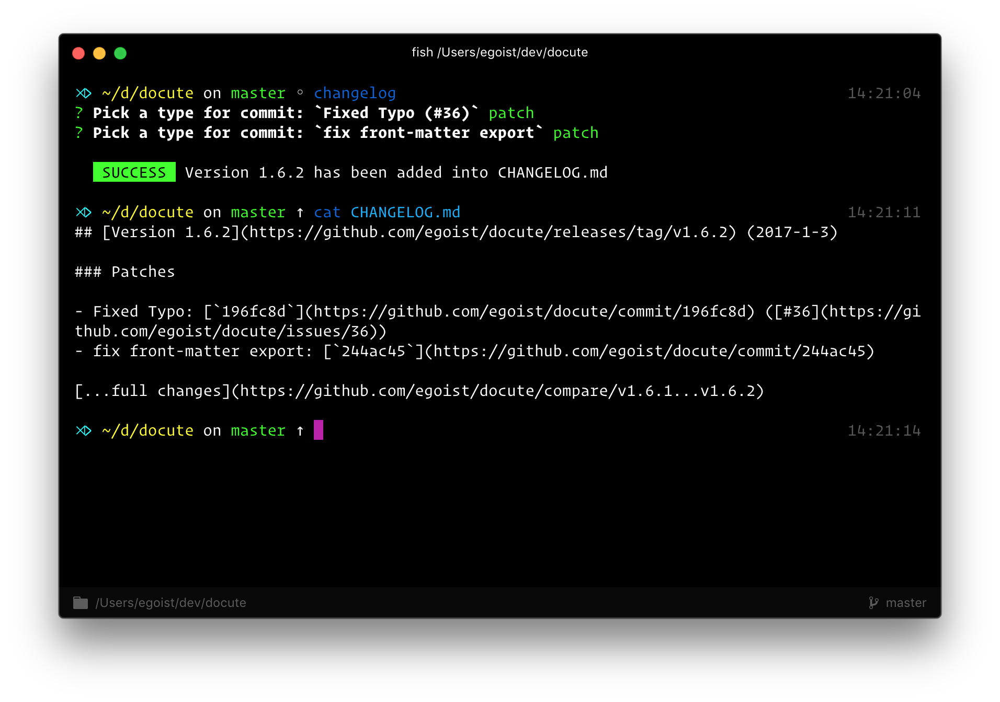

<h1 align="center">
changelog.md
</h1>

<p align="center"><a href="https://npmjs.com/package/changelog.md"></a> <a href="https://npmjs.com/package/changelog.md"></a> <a href="https://circleci.com/gh/EGOIST/changelog.md"></a> <a href="https://github.com/egoist/donate"></a></p>

<p align="center">

</p>

## How does it work

- Get last version from git tag, if no tags it defaults to `0.0.0`
- Get the commits since last version
  - Prompt user to enter the type of each commit
  - Infer the new version from the types of all commits
- Generate markdown string from commits and prompt answers
- Create or prepend to `CHANGELOG.md` and update `package.json` version field
- Commits changes and create new git tag

## Install

```bash
$ yarn global add changelog.md
```

## Usage

```bash
$ changelog
```

## Recipes

### Commit types

- patch: Bug fixes
- minor: Backward-compatible updates
- major: Introducing breaking changes
- ignore: Do not include this commit in changelog

Besides choosing `ignore` in prompts to exclude commits from changelog, the commit message that starts with `[skip]` `[ignore]` `[skip $foo]` `[ignore $foo]` will also be excluded.

You can also use format like `[$type] message` to pre-define commit type.

### Work with npm publish

```bash
# made some changes to your code...
$ git commit -am "change the world"
$ npm test
$ changelog
$ git push --follow-tags
$ npm publish
```

## Projects using this

- [SAO](https://github.com/egoist/sao): ⚔️ Futuristic scaffolding tool.
- [docute](https://github.com/egoist/docute): 📜 Effortlessly documentation done right.
- welcome to add your project here...

## Contributing

1. Fork it!
2. Create your feature branch: `git checkout -b my-new-feature`
3. Commit your changes: `git commit -am 'Add some feature'`
4. Push to the branch: `git push origin my-new-feature`
5. Submit a pull request :D


## Author

**changelog.md** © [EGOIST](https://github.com/egoist), Released under the [MIT](./LICENSE) License.<br>
Authored and maintained by EGOIST with help from contributors ([list](https://github.com/egoist/changelog.md/contributors)).

> [egoistian.com](https://egoistian.com) · GitHub [@EGOIST](https://github.com/egoist) · Twitter [@rem_rin_rin](https://twitter.com/rem_rin_rin)
